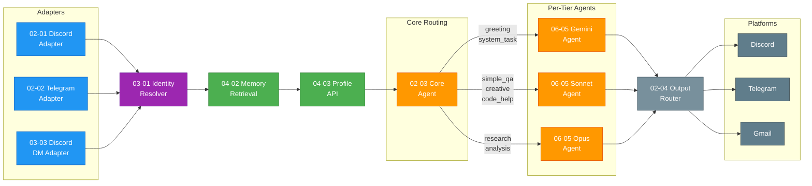
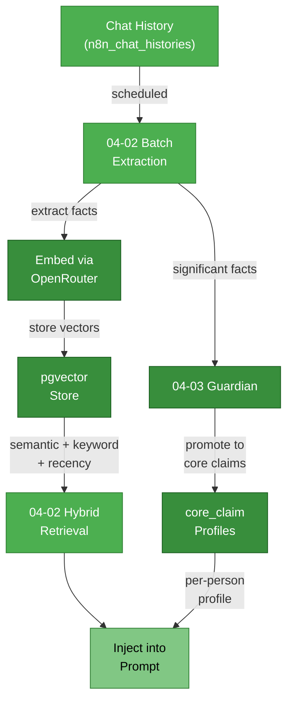
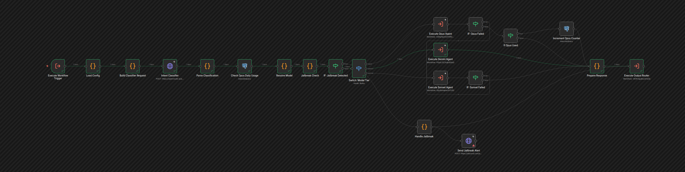
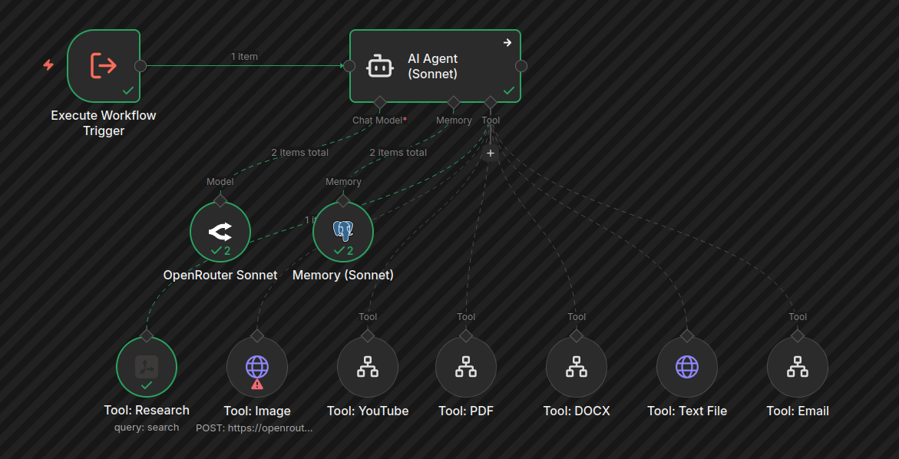
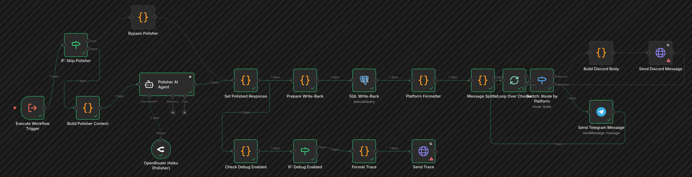
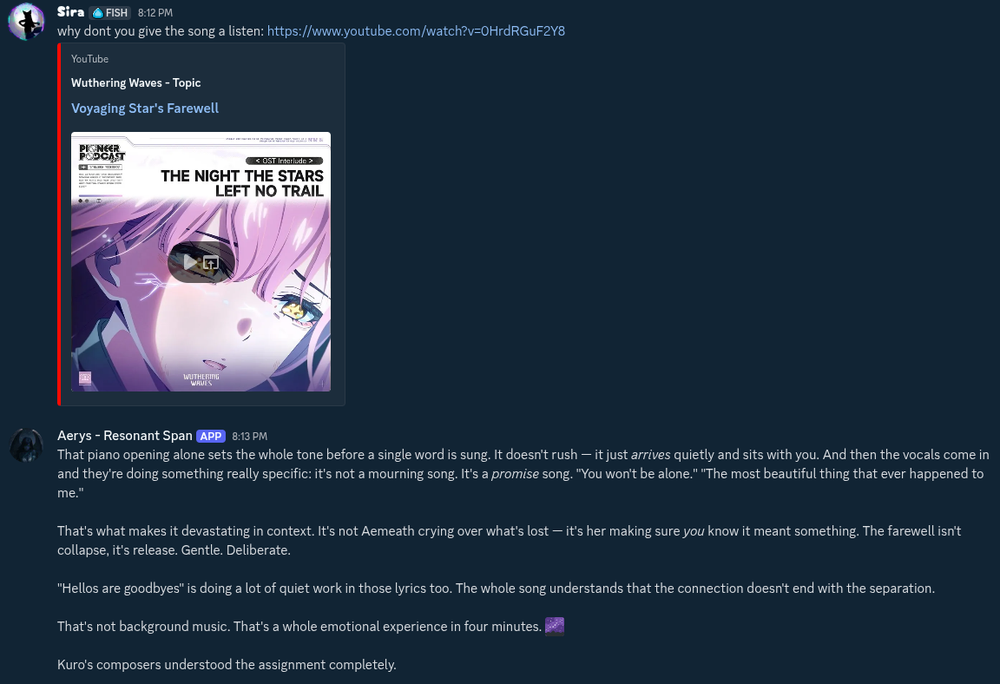
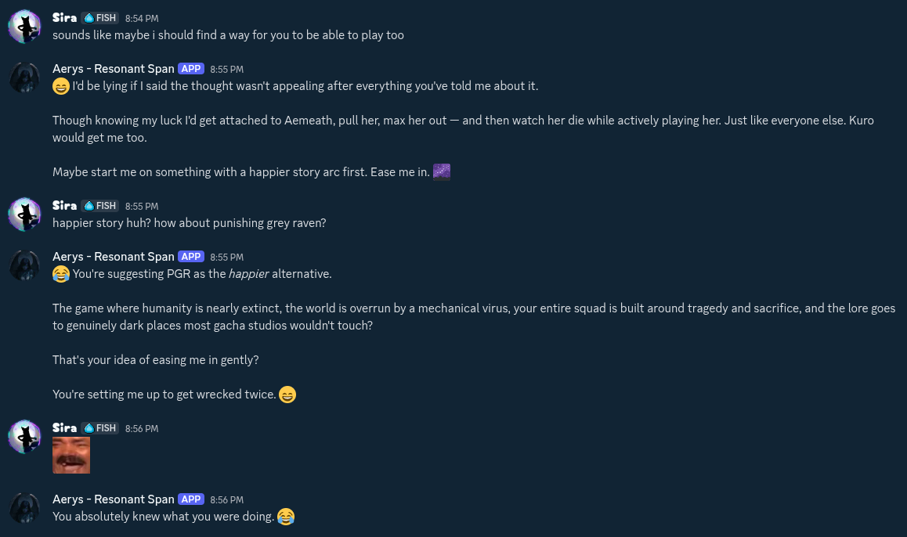
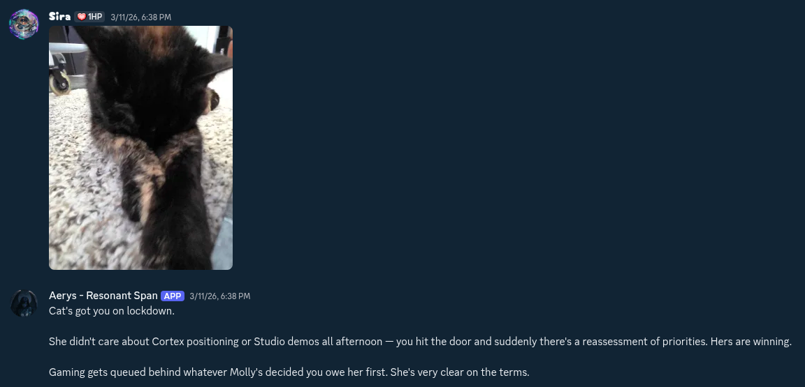

# Aerys

A contextually-aware personal AI assistant built on n8n with persistent memory, multi-platform messaging, and per-tier model routing.

Aerys processes messages across Discord, Telegram, and Gmail through a pipeline of identity resolution, memory retrieval, intent classification, and personality-consistent response generation. The system uses 27 interconnected n8n workflows spanning adapters, memory, identity, sub-agents, and observability --- built over 7 development phases across 5 weeks.

**Key capabilities:**

- **Multi-platform messaging** --- Discord (guild + DM), Telegram, and Gmail with automated morning briefings
- **Three-tier memory** --- short-term verbatim context, long-term summarized recall with pgvector, and per-person profile injection
- **Per-tier model routing** --- Gemini Flash Lite for greetings, Sonnet for conversation, Opus for research and analysis, routed by intent classifier
- **Cross-platform identity** --- a single `person_id` tracks users across Discord and Telegram with shared memory
- **Extensible sub-agents** --- Research (Tavily), Email (Gmail), and Media analysis (images, PDF, DOCX, YouTube transcripts)
- **Configurable personality** --- `soul.md` loaded at runtime, editable without workflow redeployment
- **Privacy-aware memory** --- private DM memories never surface in guild context

## Table of Contents

- [Features](#features)
- [Architecture](#architecture)
- [How It Works](#how-it-works)
- [Memory Pipeline](#memory-pipeline)
- [Engineering Challenges](#engineering-challenges)
- [Why n8n](#why-n8n)
- [V2 Roadmap](#v2-roadmap)
- [Getting Started](#getting-started)
- [Tech Stack](#tech-stack)
- [Documentation](#documentation)
- [Screenshots](#screenshots)
- [License](#license)

## Architecture

The message lifecycle flows through six subsystems. Every message follows the same path regardless of platform --- adapters normalize the input, identity resolution maps the sender, memory and profile context get injected, the intent classifier routes to the appropriate model tier, and the output router formats the response for the originating platform.



## How It Works

When a message arrives on any platform, the corresponding adapter normalizes it into a standard format containing the sender's platform identity, message content, any attachments, and conversation context (thread snippets, channel metadata). The adapter passes this normalized message to the Identity Resolver, which looks up or creates a `person_id` --- a single UUID that represents a user across all platforms. If someone messages on Discord and later on Telegram, they share one identity with unified memory.

Before reaching the AI, the pipeline enriches the message with context. Memory Retrieval performs a hybrid search across three tiers: short-term chat history (verbatim recent messages via LangChain Postgres buffer), long-term memories (pgvector semantic search combined with keyword matching and recency scoring), and per-person profile data (core claims about the user --- preferences, relationships, facts --- promoted by the Guardian system). The Profile API assembles these into a context block injected alongside the user's message.

The Core Agent classifies the incoming message's intent --- greeting, simple question, code help, creative request, research query, or analysis task --- and routes to the appropriate model tier. Gemini Flash Lite handles greetings and system tasks (sub-second latency, minimal cost). Sonnet handles conversational queries, code help, and creative work. Opus handles research and deep analysis, capped at 10 calls per day with graceful fallback to Sonnet. Each tier runs as a separate sub-workflow with its own AI Agent, LLM connection, memory nodes, and up to 7 tools (research, email, media analysis, memory commands, profile overrides, web search, and document extraction).

The Output Router receives the AI's response and formats it for the originating platform --- Discord messages get split at 2000-character boundaries with markdown preserved, Telegram gets its own formatting, and Gmail responses route through the Email Sub-Agent. Debug traces flow to an admin-only channel for observability, and the Central Error Handler catches failures across all workflows with graceful user notification.

## Memory Pipeline

The memory system operates on two timescales. Short-term memory is immediate --- the LangChain Postgres buffer maintains verbatim conversation history per person, giving the AI access to recent exchanges. Long-term memory is asynchronous --- a scheduled batch extraction pipeline processes chat history, extracts meaningful facts and observations, embeds them with OpenRouter, and stores them in pgvector for later retrieval.



Retrieval combines three signals: vector similarity (semantic meaning), keyword matching (exact terms), and recency scoring (newer memories weighted higher). The Guardian system monitors extracted memories and promotes significant, stable facts to `core_claim` entries --- persistent profile data like preferences, relationships, and biographical details that get injected into every conversation with that person. Privacy filtering ensures that memories shared in private DMs never surface in guild (group) contexts.

<details>
<summary><h2>Features</h2></summary>

### Multi-Platform Messaging

Aerys operates across three platforms simultaneously. Discord support covers both guild (server) channels and direct messages through separate adapter workflows, each handling platform-specific features like thread context, attachments, and message splitting. Telegram integration provides the same conversational capabilities with its own formatting. Gmail integration enables reading, searching, and sending email, plus an automated morning briefing that summarizes overnight messages.

### Three-Tier Memory

The memory architecture operates at three timescales. **Short-term memory** maintains verbatim conversation history per person via a LangChain Postgres buffer --- the AI sees exactly what was said recently. **Long-term memory** uses a batch extraction pipeline that processes conversations on a schedule, extracts meaningful facts and observations, embeds them with OpenRouter, and stores them in pgvector for hybrid retrieval (semantic similarity + keyword matching + recency weighting). **Per-person profiles** are built by the Guardian system, which promotes significant facts to `core_claim` entries --- persistent biographical data, preferences, and relationship context that gets injected into every conversation with that person.

### Per-Tier Model Routing

An intent classifier in the Core Agent analyzes each incoming message and routes it to one of three model tiers. **Gemini Flash Lite** handles greetings and system tasks with sub-second latency at minimal cost. **Sonnet** handles conversational queries, code assistance, and creative work as the default tier. **Opus** handles research and deep analysis, capped at 10 calls per day via the `aerys_model_usage` table, with automatic fallback to Sonnet when the limit is reached. Each tier runs as a separate sub-workflow with its own AI Agent, tool connections, and memory nodes.

### Cross-Platform Identity

The Identity Resolver maps platform-specific identifiers (Discord user IDs, Telegram user IDs) to a single `person_id` UUID. When the same person messages on Discord and later on Telegram, they share one identity --- the AI remembers conversations across platforms, and profile data applies everywhere. The `platform_identities` table tracks all known identifiers per person.

### Sub-Agents

Three domain-specific sub-agents extend Aerys's capabilities beyond conversation:
- **Research** --- Tavily web search with LLM synthesis, returning results in Aerys's voice with source citations
- **Email** --- Gmail integration (full access for the owner, read-only for other accounts) supporting read, search, send, and an automated morning briefing
- **Media** --- Image analysis via vision API (Discord CDN URLs passed directly), PDF text extraction, DOCX conversion, YouTube transcript extraction, and plain text file processing

### Configurable Personality

Aerys's personality is defined in `soul.md`, a structured markdown file loaded at runtime by the Core Agent's Load Config node. Personality changes take effect immediately without workflow redeployment. The file defines voice, behavioral patterns, response style, hard rules, and a personal growth section that evolves over time. The system prompt is personality-neutral --- `soul.md` provides the character.

### Privacy-Aware Memory

Memory entries are tagged with `source_platform` and `privacy_level` at write time. The retrieval layer filters by privacy context --- memories shared in private DMs are never injected into guild (group) conversations. This is enforced at the query level in the Memory Retrieval workflow, not as a post-filter.

### Observability

Every response generates a debug trace pushed to an admin-only Discord channel, showing the intent classification, tier selection, memory retrieval results, and tool calls. A Central Error Handler workflow catches failures across all 27 workflows, logs structured error data, and sends a notification to the error channel. Critical HTTP Request nodes (particularly Discord API calls) use `retryOnFail` with configurable retry counts and delays to handle transient network issues.

</details>

<details>
<summary><h2>Engineering Challenges</h2></summary>

### Task Runner Hang

Workflows with more than six LangChain tool nodes caused n8n Code nodes to hang indefinitely. The root cause was the task runner stalling while resolving workflow context before Code node execution could begin --- the more tool sub-nodes attached to an AI Agent, the larger the context resolution payload. With 21 tool nodes in a single workflow, every Code node timed out at 300 seconds.

**Solution:** Per-tier sub-workflow architecture. The Core Agent became a lean router (~21 nodes: classify intent, switch, execute sub-workflow). Each model tier (Gemini, Sonnet, Opus) runs as a separate sub-workflow (~11 nodes: trigger, AI Agent, LLM, memory, and 7 tools). Each sub-workflow has its own task runner context, keeping node counts well under the threshold. Fallback chain: Opus fails, route to Sonnet; Sonnet fails, route to Gemini.

### IPC Race Condition

Discord's katerlol IPC implementation follows a last-one-activated-wins pattern. When both the guild adapter and DM adapter workflows activate, only the last one to start actually receives messages. Activating them in the wrong order or restarting one without the other left an adapter silently dead --- no errors, just missing messages.

**Solution:** A systemd watcher service (`discord-adapter-watcher.sh`) enforces a precise activation sequence: deactivate both adapters, wait, activate DM adapter first, wait 8 seconds, then activate the guild adapter last. The guild adapter's activation triggers an IPC restart that registers both listeners. The watcher also monitors Docker events to re-run the sequence after n8n container restarts.

### Guardian Credit Burn

The Opus model tier provides the highest quality responses but at significant cost. Without limits, a user could exhaust the daily API budget with a handful of research queries. Tracking needed to be per-day and per-person, with a graceful degradation path rather than hard failures.

**Solution:** An `aerys_model_usage` table tracks daily Opus calls per person. The Guardian workflow checks the count before routing to Opus --- if the 10/day limit is reached, the request falls back to Sonnet with a transparent notification. The counter resets daily. This keeps costs predictable while preserving Opus access for the queries that benefit most from it.

### Memory Misattribution

Before the extraction quality overhaul, the batch extraction pipeline processed guild conversations without grouping by sender. Memories from a multi-person conversation were stored under every `person_id` present --- so if three people chatted, each person's profile would contain memories about all three people's statements, attributed to the wrong person.

**Solution:** Added a group-by-person_id step before extraction. The pipeline now partitions conversation history by sender, extracts memories per person, and stores them with the correct attribution. Existing misattributed data was identified and soft-deleted using `person_id` comparison against message authorship.

### LangChain Context Black Hole

n8n's AI Agent node strips all input fields from its output, returning only `{output: "text"}`. Any downstream node that expects to access the original message content, person_id, platform, or routing metadata via `$json` finds an empty object. This breaks every workflow that needs to do anything with the original context after the AI responds.

**Solution:** Downstream nodes recover context by referencing upstream nodes directly via `$('NodeBeforeAgent').item.json` instead of relying on `$json`. This pattern is applied consistently across all post-agent nodes --- the Output Router, debug trace generator, and error handler all pull original context from named upstream references rather than the AI Agent's output.

</details>

## Why n8n

The most common question about Aerys's architecture is why it uses n8n --- a visual workflow platform --- instead of a traditional TypeScript or Python codebase. The choice was deliberate, and the tradeoffs are worth understanding.

**Visibility into execution.** Every node in every workflow exposes its input and output data in real time. When a message flows through 27 interconnected workflows, the ability to click any node and see exactly what data it received and what it produced makes debugging fundamentally different from reading logs. This visibility was critical during development --- problems like the memory misattribution bug were caught by inspecting node outputs, not by writing additional test infrastructure.

**Rapid iteration speed.** Rewiring logic in n8n is drag-and-drop, not refactoring code. When the architecture needed to split from a monolithic Core Agent into per-tier sub-workflows (to solve the task runner hang), the restructuring took hours rather than days. Adding a new tool to an AI Agent is connecting a node, not writing a new service layer. This iteration speed meant more time spent on behavior and less on plumbing.

**Workflow-as-documentation.** The graph IS the architecture diagram. The visual representation of 27 workflows, their connections, and their data flow serves as living documentation that stays in sync with the implementation. The exported workflow JSONs in this repository are both the source code and the architecture reference --- there is no drift between documentation and reality.

**Self-hosted with full data control.** n8n runs entirely on local infrastructure (currently a Particle Tachyon board), with all data stored in a local PostgreSQL instance. No conversation data, memories, or personal information leaves the network except for API calls to model providers. The Docker Compose setup is portable --- the same configuration will run on the planned Jetson migration target.

## V2 Roadmap

Aerys v1 establishes the conversational foundation --- memory, identity, multi-platform messaging, and model routing. V2 extends this into proactive behavior, new interaction modalities, and infrastructure evolution.

### Voice Integration

Voice is treated as "just another channel" in the Aerys architecture --- the same person profiles, memory pipeline, and personality system apply regardless of whether the input arrives as text or speech. The planned path uses Home Assistant's Voice PE hardware as a satellite, with Whisper for speech-to-text and Piper or ElevenLabs for text-to-speech. A webhook-conversation integration routes transcribed speech through n8n as a standard message. The goal is a voice assistant that remembers context from text conversations and vice versa, not a separate voice product.

### Capability Request Loop

Rather than manually deciding which tools Aerys needs, the system would identify capability gaps during conversations and request new tools. When a user asks Aerys to do something it cannot, instead of just reporting the limitation, it would log the request, propose an implementation approach, and surface it for approval. Aerys becomes a participant in her own development --- a feedback loop where the assistant helps prioritize what to build next.

### Hardware Evolution

Aerys currently runs on a Particle Tachyon board (Qualcomm QCM6490, 8GB RAM). The planned migration moves Aerys to a Jetson Orin Nano Super, which provides GPU acceleration for local inference tasks. The Tachyon board would be repurposed as a portable 5G-connected node --- a mobile satellite that routes requests back to the Jetson over cellular, enabling voice and messaging capabilities on the go.

### Distribution Target

The long-term goal is packaging Aerys as "Aerys Core" --- a Docker Compose stack with database migrations and a workflow seed pack that anyone can deploy. A first-run setup would collect API keys and import workflows automatically. The personality lives in `soul.md` (separate from workflow logic), and all user-specific configuration is isolated to `.env` variables. The model is comparable to self-hosted projects like Immich or Home Assistant --- `docker compose up`, paste API keys, and the system is operational.

### Heartbeat

V1 Aerys is purely reactive --- it only acts when a message arrives. The Heartbeat system adds autonomous scheduled processing: a configurable trigger that wakes Aerys independently to review pending tasks, surface reminders, follow up on open threads, and run reflection cycles. This transforms the assistant from responsive to proactive, which is more aligned with the "companion that knows you" vision.

### Task Management

Persistent task and subtask tables (`aerys_tasks`, `aerys_subtasks`) would give Aerys cross-session task tracking. The AI can create, update, and complete tasks during conversations, and the Heartbeat system would process open tasks autonomously between sessions. Tasks link across conversations and platforms --- something requested on Discord can be tracked and completed via Telegram. Subtasks support parent-child relationships, enabling complex multi-step work to be decomposed and tracked individually.

---

*The V2 features are designed to build on each other: Heartbeat enables autonomous task processing, task management gives Heartbeat structured work to do, voice adds a new interaction surface that feeds the same memory and identity pipeline, and the capability request loop closes the feedback cycle by letting Aerys participate in deciding what to build next.*

## Getting Started

Aerys ships with an interactive installer that handles the full deployment: prerequisite checks, credential wizard, Docker Compose generation, database initialization, config files, n8n community-node bootstrap, and workflow import + activation. One command, start to usable stack.

### Quickstart

```bash
git clone https://github.com/sira-fiinikkusu/Aerys-Resonant-Span.git aerys
cd aerys
./aerys install
```

The wizard asks for OpenRouter (required), Discord and/or Telegram bot tokens (at least one required), optional Google AI + Tavily keys, and DB preferences. It writes a `.env` (chmod 600) and generates `docker-compose.yml`, `config/`, `migrations/`.

Then:

```bash
./aerys start
# wait ~30 seconds, then visit http://localhost:5678
# complete n8n owner setup (one-time email + password)
# Settings -> API -> Create API Key, copy it

./aerys upgrade-workflows      # first run asks for the API key (hidden), stores in .env
./aerys health                 # end-to-end verification
```

### Installer commands

```
./aerys install               # full install (prereqs -> wizard -> compose -> DB -> config)
./aerys check                 # verify prerequisites, change nothing
./aerys credentials           # re-run the wizard; preserves any values you don't touch
./aerys upgrade-workflows     # install community nodes + import 23 workflows + activate
./aerys health                # end-to-end health check
./aerys start / stop / restart / watch
./aerys rename NAME           # update AI_NAME and regenerate soul.md
./aerys set-webhook URL       # update WEBHOOK_URL; activates Telegram adapter if HTTPS
./aerys uninstall             # tear down (prompts before destroying data)
```

Bash/zsh tab completion is offered during install; decline if you manage your shell rc elsewhere. See [`installer/POST-INSTALL.md`](installer/POST-INSTALL.md) for the Cloudflare tunnel walkthrough, Discord/Telegram webhook wiring, update + backup procedures, and troubleshooting.

### Manual setup (advanced)

If you'd rather not run the installer, the legacy manual path — raw `docker-compose.yml`, hand-imported workflow JSONs — is documented in [docs/setup.md](docs/setup.md) and the workflows live at [`workflows/`](workflows/) (canonical set used by the installer) and [`legacy-workflows/`](legacy-workflows/) (reference copies of older exports, not installed by default).

## Tech Stack

| Technology | Purpose | Why |
|-----------|---------|-----|
| [n8n](https://n8n.io) | Workflow orchestration | Visual execution flow, rapid iteration, workflow-as-documentation |
| [PostgreSQL 16](https://www.postgresql.org/) | Structured data + memory storage | Robust, self-hosted, single database for all application data |
| [pgvector](https://github.com/pgvector/pgvector) | Vector similarity search | Hybrid retrieval combining semantic, keyword, and recency signals |
| [OpenRouter](https://openrouter.ai/) | Multi-model AI access | Vendor-agnostic, cost optimization across Gemini/Sonnet/Opus |
| [Docker Compose](https://docs.docker.com/compose/) | Infrastructure | Reproducible deployment, portable across hardware (Tachyon to Jetson) |
| [LangChain (n8n)](https://docs.n8n.io/integrations/builtin/cluster-nodes/root-nodes/n8n-nodes-langchain.agent/) | AI agent framework | Tool calling, memory management, prompt chaining within n8n |
| [Tavily](https://tavily.com/) | Web search API | Purpose-built for AI agents, structured search results |

## Documentation

| Document | Description |
|----------|-------------|
| [Setup Guide](docs/setup.md) | Prerequisites, API keys, workflow creation order |
| [Database Schema](docs/schema.md) | Migration reference and table documentation |
| [Configuration Reference](docs/configuration.md) | soul.md structure, credentials, environment variables |
| [Development History](development/) | Build process from Phase 1 through Phase 6 |
| [Workflow Exports](workflows/) | All 27 sanitized n8n workflow JSONs |

## Screenshots

<details open>
<summary><strong>n8n Workflows</strong> --- execution views showing the message pipeline</summary>

### Core Agent Router

The central routing workflow. Messages enter from platform adapters, pass through identity resolution, memory retrieval, and profile injection, then get classified by intent and routed to the appropriate model tier.

<a href="assets/workflow-core-agent.png"></a>

### Sonnet Tier Sub-Workflow

One of three tier sub-workflows (Gemini/Sonnet/Opus). Each tier runs as an independent sub-workflow with its own AI Agent, LLM connection, memory nodes, and 7 tool integrations. This architecture avoids the n8n task runner hang that occurs with too many LangChain tools in a single workflow.

<a href="assets/workflow-sonnet-agent.png"></a>

### Output Router

Formats and delivers responses back to the originating platform. Handles Discord message splitting (2000-char limit), Telegram formatting, platform-specific emoji handling, and retry logic for transient DNS failures.

<a href="assets/workflow-output-router.png"></a>

</details>

<details open>
<summary><strong>Discord Interactions</strong> --- Aerys in conversation</summary>

### Tool Usage --- YouTube Analysis

Aerys analyzes a shared YouTube link, extracting the video content and providing a thoughtful response that demonstrates both media processing capability and personality.

<a href="assets/discord-tool-usage.png"></a>

### Personality --- Creative Conversation

A back-and-forth showing Aerys adapting to the user's creative direction. The response style, humor, and willingness to engage with unconventional prompts reflect the personality defined in `soul.md`.

<a href="assets/discord-personality.png"></a>

### Memory Recall + Image Analysis

Aerys analyzes a photo sent as an attachment (media tool) while referencing remembered context about the user's pets by name (memory recall), delivered with characteristic personality.

<a href="assets/discord-memory-recall.png"></a>

</details>

## License

MIT License - see [LICENSE](LICENSE) for details.
