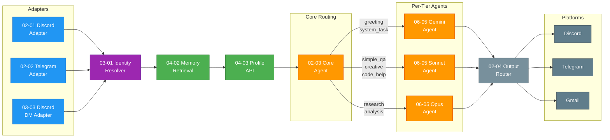
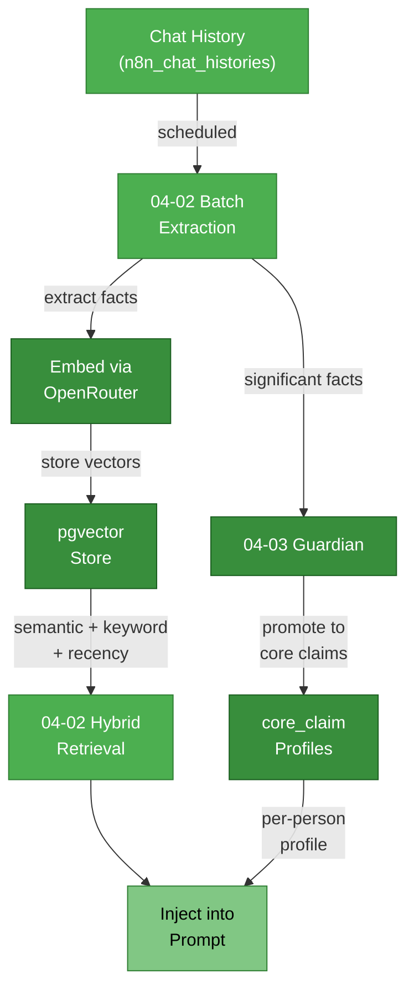

# Aerys

A contextually-aware personal AI assistant built on n8n with persistent memory, multi-platform messaging, and per-tier model routing.

Aerys processes messages across Discord, Telegram, and Gmail through a pipeline of identity resolution, memory retrieval, intent classification, and personality-consistent response generation. The system uses 27 interconnected n8n workflows spanning adapters, memory, identity, sub-agents, and observability --- built over 7 development phases across 5 weeks.

**Key capabilities:**

- **Multi-platform messaging** --- Discord (guild + DM), Telegram, and Gmail with automated morning briefings
- **Three-tier memory** --- short-term verbatim context, long-term summarized recall with pgvector, and per-person profile injection
- **Per-tier model routing** --- Gemini Flash Lite for greetings, Sonnet for conversation, Opus for research and analysis, routed by intent classifier
- **Cross-platform identity** --- a single `person_id` tracks users across Discord and Telegram with shared memory
- **Extensible sub-agents** --- Research (Tavily), Email (Gmail), and Media analysis (images, PDF, DOCX, YouTube transcripts)
- **Configurable personality** --- `soul.md` loaded at runtime, editable without workflow redeployment
- **Privacy-aware memory** --- private DM memories never surface in guild context

## Table of Contents

- [Features](#features)
- [Architecture](#architecture)
- [How It Works](#how-it-works)
- [Memory Pipeline](#memory-pipeline)
- [Engineering Challenges](#engineering-challenges)
- [Why n8n](#why-n8n)
- [V2 Roadmap](#v2-roadmap)
- [Getting Started](#getting-started)
- [Tech Stack](#tech-stack)
- [Documentation](#documentation)
- [License](#license)

## Architecture

The message lifecycle flows through six subsystems. Every message follows the same path regardless of platform --- adapters normalize the input, identity resolution maps the sender, memory and profile context get injected, the intent classifier routes to the appropriate model tier, and the output router formats the response for the originating platform.

## How It Works

When a message arrives on any platform, the corresponding adapter normalizes it into a standard format containing the sender's platform identity, message content, any attachments, and conversation context (thread snippets, channel metadata). The adapter passes this normalized message to the Identity Resolver, which looks up or creates a `person_id` --- a single UUID that represents a user across all platforms. If someone messages on Discord and later on Telegram, they share one identity with unified memory.

Before reaching the AI, the pipeline enriches the message with context. Memory Retrieval performs a hybrid search across three tiers: short-term chat history (verbatim recent messages via LangChain Postgres buffer), long-term memories (pgvector semantic search combined with keyword matching and recency scoring), and per-person profile data (core claims about the user --- preferences, relationships, facts --- promoted by the Guardian system). The Profile API assembles these into a context block injected alongside the user's message.

The Core Agent classifies the incoming message's intent --- greeting, simple question, code help, creative request, research query, or analysis task --- and routes to the appropriate model tier. Gemini Flash Lite handles greetings and system tasks (sub-second latency, minimal cost). Sonnet handles conversational queries, code help, and creative work. Opus handles research and deep analysis, capped at 10 calls per day with graceful fallback to Sonnet. Each tier runs as a separate sub-workflow with its own AI Agent, LLM connection, memory nodes, and up to 7 tools (research, email, media analysis, memory commands, profile overrides, web search, and document extraction).

The Output Router receives the AI's response and formats it for the originating platform --- Discord messages get split at 2000-character boundaries with markdown preserved, Telegram gets its own formatting, and Gmail responses route through the Email Sub-Agent. Debug traces flow to an admin-only channel for observability, and the Central Error Handler catches failures across all workflows with graceful user notification.

## Memory Pipeline

The memory system operates on two timescales. Short-term memory is immediate --- the LangChain Postgres buffer maintains verbatim conversation history per person, giving the AI access to recent exchanges. Long-term memory is asynchronous --- a scheduled batch extraction pipeline processes chat history, extracts meaningful facts and observations, embeds them with OpenRouter, and stores them in pgvector for later retrieval.

Retrieval combines three signals: vector similarity (semantic meaning), keyword matching (exact terms), and recency scoring (newer memories weighted higher). The Guardian system monitors extracted memories and promotes significant, stable facts to `core_claim` entries --- persistent profile data like preferences, relationships, and biographical details that get injected into every conversation with that person. Privacy filtering ensures that memories shared in private DMs never surface in guild (group) contexts.

<h2>Features</h2>

### Multi-Platform Messaging

Aerys operates across three platforms simultaneously. Discord support covers both guild (server) channels and direct messages through separate adapter workflows, each handling platform-specific features like thread context, attachments, and message splitting. Telegram integration provides the same conversational capabilities with its own formatting. Gmail integration enables reading, searching, and sending email, plus an automated morning briefing that summarizes overnight messages.

### Three-Tier Memory

The memory architecture operates at three timescales. **Short-term memory** maintains verbatim conversation history per person via a LangChain Postgres buffer --- the AI sees exactly what was said recently. **Long-term memory** uses a batch extraction pipeline that processes conversations on a schedule, extracts meaningful facts and observations, embeds them with OpenRouter, and stores them in pgvector for hybrid retrieval (semantic similarity + keyword matching + recency weighting). **Per-person profiles** are built by the Guardian system, which promotes significant facts to `core_claim` entries --- persistent biographical data, preferences, and relationship context that gets injected into every conversation with that person.

### Per-Tier Model Routing

An intent classifier in the Core Agent analyzes each incoming message and routes it to one of three model tiers. **Gemini Flash Lite** handles greetings and system tasks with sub-second latency at minimal cost. **Sonnet** handles conversational queries, code assistance, and creative work as the default tier. **Opus** handles research and deep analysis, capped at 10 calls per day via the `aerys_model_usage` table, with automatic fallback to Sonnet when the limit is reached. Each tier runs as a separate sub-workflow with its own AI Agent, tool connections, and memory nodes.

### Cross-Platform Identity

The Identity Resolver maps platform-specific identifiers (Discord user IDs, Telegram user IDs) to a single `person_id` UUID. When the same person messages on Discord and later on Telegram, they share one identity --- the AI remembers conversations across platforms, and profile data applies everywhere. The `platform_identities` table tracks all known identifiers per person.

### Sub-Agents

Three domain-specific sub-agents extend Aerys's capabilities beyond conversation:
- **Research** --- Tavily web search with LLM synthesis, returning results in Aerys's voice with source citations
- **Email** --- Gmail integration (full access for the owner, read-only for other accounts) supporting read, search, send, and an automated morning briefing
- **Media** --- Image analysis via vision API (Discord CDN URLs passed directly), PDF text extraction, DOCX conversion, YouTube transcript extraction, and plain text file processing

### Configurable Personality

Aerys's personality is defined in `soul.md`, a structured markdown file loaded at runtime by the Core Agent's Load Config node. Personality changes take effect immediately without workflow redeployment. The file defines voice, behavioral patterns, response style, hard rules, and a personal growth section that evolves over time. The system prompt is personality-neutral --- `soul.md` provides the character.

### Privacy-Aware Memory

Memory entries are tagged with `source_platform` and `privacy_level` at write time. The retrieval layer filters by privacy context --- memories shared in private DMs are never injected into guild (group) conversations. This is enforced at the query level in the Memory Retrieval workflow, not as a post-filter.

### Observability

Every response generates a debug trace pushed to an admin-only Discord channel, showing the intent classification, tier selection, memory retrieval results, and tool calls. A Central Error Handler workflow catches failures across all 27 workflows, logs structured error data, and sends a notification to the error channel. Critical HTTP Request nodes (particularly Discord API calls) use `retryOnFail` with configurable retry counts and delays to handle transient network issues.

<!-- TASK 2 CONTINUES BELOW -->
