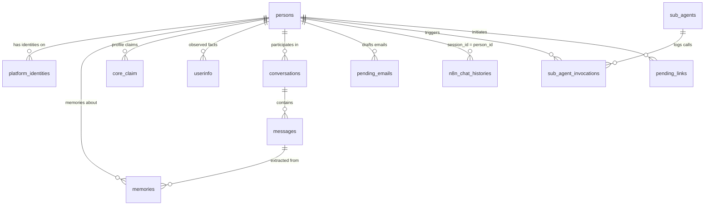

# Database Schema

Aerys uses a **two-database architecture**. The n8n platform maintains its own internal database (`n8n`) for workflow definitions, execution history, credentials, and settings. Aerys application data lives in a separate `aerys` database on the same PostgreSQL instance — identity records, memories, profiles, conversation history, and sub-agent configuration all reside here. All migrations documented below target the Aerys application database.

The Aerys database uses two PostgreSQL extensions: **pgvector** for vector similarity search on memory embeddings, and **uuid-ossp** for UUID primary key generation.

## Migration History

Migrations run automatically on first database creation via `docker-entrypoint-initdb.d`. They execute in alphabetical order by filename. The numbering follows phase numbers rather than sequential count, which explains the gap at `003`.

| Migration | File | Phase | Purpose |
|-----------|------|-------|---------|
| 000 | [`000_extensions.sql`](../migrations/000_extensions.sql) | 1 | Create Aerys database, enable pgvector and uuid-ossp extensions |
| 001 | [`001_init.sql`](../migrations/001_init.sql) | 1 | Core tables: persons, conversations, messages, memories with HNSW index |
| 002 | [`002_identity.sql`](../migrations/002_identity.sql) | 3 | Platform identities for cross-platform person resolution |
| 004 | [`004_memory_system.sql`](../migrations/004_memory_system.sql) | 4 | Memory provenance (source_platform, privacy_level), userinfo, core_claim, audit_log |
| 005 | [`005_fix_core_claim_visibility.sql`](../migrations/005_fix_core_claim_visibility.sql) | 4 | Fix core_claim visibility default from 'server' to 'all' |
| 006 | [`006_sub_agents.sql`](../migrations/006_sub_agents.sql) | 5 | Sub-agent registry, email draft staging, invocation logging |
| 007 | [`007_memory_extraction_quality.sql`](../migrations/007_memory_extraction_quality.sql) | 5.1 | Memory quality: key_label, context, event_date columns with dedup index |
| 008 | [`008_sub_agent_lifecycle.sql`](../migrations/008_sub_agent_lifecycle.sql) | 6 | Sub-agent state management (ready/failed/disabled) and dependency declarations |

See [`migrations/`](../migrations/) for the full SQL source of each migration.

## Table Reference

### persons

Core identity table. One row per real person across all platforms. Acts as the universal foreign key for all person-scoped data.

| Column | Type | Purpose |
|--------|------|---------|
| `id` | `UUID` (PK) | Primary key, auto-generated |
| `display_name` | `TEXT NOT NULL` | Human-readable name |
| `discord_id` | `TEXT UNIQUE` | Legacy Discord user ID (superseded by platform_identities) |
| `telegram_id` | `TEXT UNIQUE` | Legacy Telegram user ID (superseded by platform_identities) |
| `email` | `TEXT UNIQUE` | Email address |
| `timezone` | `TEXT` | Person's timezone for time-aware responses |
| `preferences` | `JSONB` | Free-form preference storage |
| `relationship_notes` | `TEXT` | How Aerys relates to this person |
| `interaction_notes` | `TEXT` | Notes about interaction patterns |
| `important_dates` | `JSONB` | Birthdays, anniversaries, etc. |
| `custom_fields` | `JSONB` | Extensible metadata |
| `created_at` | `TIMESTAMPTZ` | Record creation timestamp |
| `updated_at` | `TIMESTAMPTZ` | Last modification timestamp |
| `deleted_at` | `TIMESTAMPTZ` | Soft delete timestamp |

**Indexes:** Partial indexes on `discord_id`, `telegram_id`, and `email` (only non-null values indexed).

### platform_identities

Maps platform-specific user IDs to person records. Authoritative store for cross-platform identity resolution from Phase 3 forward. The legacy `discord_id` and `telegram_id` columns on `persons` are kept for backward compatibility but `platform_identities` is the canonical reference.

| Column | Type | Purpose |
|--------|------|---------|
| `id` | `UUID` (PK) | Primary key |
| `person_id` | `UUID` (FK → persons) | The person this identity belongs to |
| `platform` | `TEXT NOT NULL` | Platform name: `'discord'`, `'telegram'` |
| `platform_user_id` | `TEXT NOT NULL` | Raw platform user ID (always stored as string) |
| `username` | `TEXT` | Display name from platform at link time |
| `linked_at` | `TIMESTAMPTZ` | When this identity was linked |

**Constraints:** `UNIQUE (platform, platform_user_id)` — one account per platform per person.
**Indexes:** `(person_id)` for joins, `(platform, platform_user_id)` for identity lookups.

### pending_links

Short-lived verification codes for user-initiated cross-platform identity linking. When a user on Discord wants to link their Telegram identity, a code is generated here and must be entered on the target platform before expiry.

| Column | Type | Purpose |
|--------|------|---------|
| `id` | `UUID` (PK) | Primary key |
| `code` | `TEXT UNIQUE` | Verification code |
| `person_id` | `UUID` (FK → persons) | Person initiating the link |
| `platform` | `TEXT NOT NULL` | Platform where the code was issued |
| `expires_at` | `TIMESTAMPTZ NOT NULL` | Code expiration timestamp |
| `created_at` | `TIMESTAMPTZ` | Record creation timestamp |

### conversations

Tracks conversation contexts per channel. Groups messages into logical threads for context windowing.

| Column | Type | Purpose |
|--------|------|---------|
| `id` | `UUID` (PK) | Primary key |
| `person_id` | `UUID` (FK → persons) | Primary participant |
| `channel` | `TEXT NOT NULL` | Channel identifier |
| `channel_thread_id` | `TEXT` | Thread ID within channel |
| `summary` | `TEXT` | Conversation summary |
| `started_at` | `TIMESTAMPTZ` | Conversation start time |
| `last_message_at` | `TIMESTAMPTZ` | Most recent message timestamp |
| `ended_at` | `TIMESTAMPTZ` | Conversation end time |
| `deleted_at` | `TIMESTAMPTZ` | Soft delete timestamp |

### messages

Individual message records with full content and metadata. Supports full-text search and chronological replay.

| Column | Type | Purpose |
|--------|------|---------|
| `id` | `UUID` (PK) | Primary key |
| `conversation_id` | `UUID` (FK → conversations) | Parent conversation |
| `person_id` | `UUID` (FK → persons) | Message sender |
| `channel` | `TEXT NOT NULL` | Source channel |
| `role` | `TEXT NOT NULL` | One of `'user'`, `'assistant'`, `'system'` |
| `content` | `TEXT NOT NULL` | Message body |
| `content_type` | `TEXT` | MIME type (default: `'text'`) |
| `raw_metadata` | `JSONB` | Platform-specific metadata |
| `created_at` | `TIMESTAMPTZ` | Message timestamp |
| `deleted_at` | `TIMESTAMPTZ` | Soft delete timestamp |

**Indexes:** On `conversation_id`, `person_id`, `channel`, and `created_at DESC`.

### memories

Long-term memory storage with vector embeddings for semantic retrieval. Each memory is a distilled observation about a person, extracted from conversation history by the batch extraction pipeline.

| Column | Type | Purpose |
|--------|------|---------|
| `id` | `UUID` (PK) | Primary key |
| `person_id` | `UUID` (FK → persons) | Person this memory is about |
| `source_message_id` | `UUID` (FK → messages) | Original message source |
| `content` | `TEXT NOT NULL` | Memory content (format: `key_label: value`) |
| `summary` | `TEXT` | Condensed version |
| `category` | `TEXT[]` | Category tags |
| `embedding` | `vector(1536)` | OpenAI-compatible embedding for similarity search |
| `channel` | `TEXT` | Source channel |
| `source_platform` | `TEXT` | Platform where this was observed (added in migration 004) |
| `privacy_level` | `TEXT NOT NULL` | `'public'` or `'private'` — controls retrieval filtering |
| `batch_job_id` | `UUID` | Extraction batch identifier |
| `processed_at` | `TIMESTAMPTZ` | When the memory was processed |
| `context` | `TEXT` | Surrounding conversation context (added in migration 007) |
| `event_date` | `TEXT` | When the remembered event occurred (added in migration 007) |
| `key_label` | `TEXT` | Structured label for deduplication (added in migration 007) |
| `created_at` | `TIMESTAMPTZ` | Record creation timestamp |
| `updated_at` | `TIMESTAMPTZ` | Last modification timestamp |
| `deleted_at` | `TIMESTAMPTZ` | Soft delete timestamp |

**Indexes:**
- `idx_memories_embedding` — HNSW index using `vector_cosine_ops` for fast approximate nearest neighbor search
- `idx_memories_person` — person_id lookup
- `idx_memories_category` — GIN index on category array
- `idx_memories_active` — partial index on non-deleted rows
- `idx_memories_privacy` — composite `(person_id, privacy_level)` for privacy-filtered retrieval
- `idx_memories_dedup` — composite `(person_id, key_label)` on non-deleted rows with non-null key_label

### userinfo

Raw extracted observations from conversations — every mention of a fact about a person before promotion to a core claim. The Guardian workflow reads this table to identify patterns worth promoting.

| Column | Type | Purpose |
|--------|------|---------|
| `id` | `UUID` (PK) | Primary key |
| `speaker_id` | `UUID` (FK → persons) | Person this fact is about |
| `key_label` | `TEXT NOT NULL` | Fact category (e.g., `'job_title'`, `'pet_name'`) |
| `value_text` | `TEXT NOT NULL` | Observed value |
| `value_norm` | `JSONB` | Normalized/structured representation |
| `sensitivity` | `TEXT` | Privacy sensitivity level (default: `'P2'`) |
| `asserted_by` | `TEXT` | Who stated this fact (default: `'third_party'`) |
| `source_gist_id` | `UUID` | Source observation identifier |
| `model_conf` | `NUMERIC(4,3)` | Model confidence score |
| `first_seen` | `TIMESTAMPTZ` | First observation timestamp |
| `last_seen` | `TIMESTAMPTZ` | Most recent observation timestamp |

**Indexes:** On `(speaker_id)` and `(speaker_id, key_label)`.

### core_claim

Promoted, confirmed facts about a person — injected into AI prompts for immediate contextual awareness. The Guardian workflow promotes observations from `userinfo` to `core_claim` when they reach sufficient confidence.

| Column | Type | Purpose |
|--------|------|---------|
| `core_id` | `UUID` (PK) | Primary key |
| `speaker_id` | `UUID` (FK → persons) | Person this claim is about |
| `key_label` | `TEXT NOT NULL` | Claim category |
| `claim_text` | `TEXT NOT NULL` | The confirmed fact |
| `value_norm` | `JSONB` | Structured representation |
| `sensitivity` | `TEXT` | Privacy level (default: `'P2'`) |
| `status` | `TEXT NOT NULL` | Claim status: `'proposed'`, `'confirmed'`, etc. |
| `locked` | `BOOLEAN` | Whether the claim is locked from automatic updates |
| `confidence` | `NUMERIC(4,3)` | Promotion confidence score |
| `ttl_ts` | `TIMESTAMPTZ` | Time-to-live for expiring claims |
| `visibility` | `TEXT` | Where this claim surfaces: `'all'`, `'server'`, `'dm'` |
| `created_at` | `TIMESTAMPTZ` | Record creation timestamp |
| `last_seen` | `TIMESTAMPTZ` | Most recent observation timestamp |

**Constraints:** `UNIQUE (speaker_id, key_label)` — one active claim per category per person.
**Indexes:** On `(speaker_id)` and `(status)` filtered to non-proposed claims.

### n8n_chat_histories

LangChain short-term memory buffer. Stores recent conversation turns for context injection. Managed by n8n's `memoryPostgresChat` nodes — not directly written by application code.

| Column | Type | Purpose |
|--------|------|---------|
| `session_id` | `TEXT` | Session key — set to `person_id` for cross-platform session continuity |
| `message` | `JSONB` | Serialized LangChain message (role + content) |
| `created_at` | `TIMESTAMPTZ` | Message timestamp |

> **Key design choice:** Using `person_id` as the session key means a person's short-term context follows them across platforms. A conversation started in Discord continues seamlessly in Telegram.

### audit_log

Operation audit trail for Guardian promotions, user overrides, and other state-changing operations.

| Column | Type | Purpose |
|--------|------|---------|
| `id` | `UUID` (PK) | Primary key |
| `who` | `TEXT NOT NULL` | Actor (system component or person identifier) |
| `action` | `TEXT NOT NULL` | Action performed |
| `details` | `JSONB` | Action-specific metadata |
| `created_at` | `TIMESTAMPTZ` | Timestamp |

### sub_agents

Registry of available sub-agent workflows with capabilities, health state, and dependency declarations.

| Column | Type | Purpose |
|--------|------|---------|
| `id` | `SERIAL` (PK) | Auto-incrementing primary key |
| `name` | `TEXT UNIQUE` | Agent identifier (e.g., `'media_agent'`) |
| `description` | `TEXT NOT NULL` | Human-readable capability description |
| `workflow_id` | `TEXT NOT NULL` | n8n workflow ID for this agent |
| `trigger_hints` | `TEXT` | Comma-separated phrases for LLM fuzzy matching |
| `capability_id` | `TEXT NOT NULL` | Dot-notation stable ID (e.g., `'media'`, `'research.web'`, `'email'`) |
| `enabled` | `BOOLEAN` | Whether the agent accepts invocations |
| `state` | `TEXT NOT NULL` | Health state: `'ready'`, `'failed'`, or `'disabled'` |
| `dependencies` | `JSONB` | Service dependency declarations (credential IDs, optional flags) |
| `created_at` | `TIMESTAMPTZ` | Registration timestamp |

**Constraints:** Check constraint on `state` (must be one of `ready`, `failed`, `disabled`).

### sub_agent_invocations

Logs every sub-agent call for future routing optimization. The `outcome` column starts `NULL` and is populated by a future feedback loop system that detects whether routing decisions were appropriate.

| Column | Type | Purpose |
|--------|------|---------|
| `id` | `SERIAL` (PK) | Auto-incrementing primary key |
| `person_id` | `UUID` | Person who triggered the invocation |
| `capability_id` | `TEXT NOT NULL` | Which capability was invoked |
| `agent_name` | `TEXT NOT NULL` | Which agent handled it |
| `user_message` | `TEXT` | First 300 characters of the triggering message |
| `result_summary` | `TEXT` | First 300 characters of the result |
| `outcome` | `TEXT` | Routing quality assessment (populated by future V2 system) |
| `invoked_at` | `TIMESTAMPTZ` | Invocation timestamp |

### pending_emails

Email draft staging table for the draft-then-confirm flow. When a user asks Aerys to send an email, the draft is stored here for review before sending.

| Column | Type | Purpose |
|--------|------|---------|
| `id` | `SERIAL` (PK) | Auto-incrementing primary key |
| `person_id` | `UUID NOT NULL` | Person who requested the email |
| `to_address` | `TEXT NOT NULL` | Recipient email address |
| `subject` | `TEXT NOT NULL` | Email subject line |
| `body` | `TEXT NOT NULL` | Email body content |
| `status` | `TEXT NOT NULL` | Draft status: `'pending'`, `'sent'`, `'cancelled'` |
| `created_at` | `TIMESTAMPTZ` | Draft creation timestamp |
| `expires_at` | `TIMESTAMPTZ` | Auto-expiry (default: 30 minutes after creation) |

## Key Design Patterns

### Soft Deletes

Multiple tables use a `deleted_at` column rather than hard deletes. Partial indexes exclude soft-deleted rows (e.g., `WHERE deleted_at IS NULL`) so they do not impact query performance. This preserves audit history while keeping active queries fast.

### pgvector HNSW Index

The `memories.embedding` column stores 1536-dimensional vectors (OpenAI text-embedding-ada-002 compatible). An HNSW (Hierarchical Navigable Small World) index with cosine distance operators enables fast approximate nearest neighbor search — retrieving semantically similar memories in milliseconds rather than scanning every row.

### person_id as Universal Identity Key

All person-scoped tables reference `persons.id` as a foreign key. This enables queries that join across memories, profiles, conversation history, and platform identities using a single identifier. The `n8n_chat_histories` table uses `person_id` as its `session_id` value, unifying short-term context across platforms.

### Privacy-Filtered Retrieval

Memories are tagged with `privacy_level` (`'public'` or `'private'`) at write time based on the source context (DM vs. guild channel). The retrieval layer filters by privacy level — private memories shared in DMs never surface in public/group contexts. This is enforced at query time with `WHERE privacy_level` conditions on the `idx_memories_privacy` composite index.

### CTE-Based Atomic Row Replacement

For tables with unique constraints (like `core_claim` with `UNIQUE (speaker_id, key_label)`), updates use a CTE pattern: `WITH soft_del AS (UPDATE ... SET deleted_at = NOW() ... RETURNING id) INSERT INTO ...`. This runs atomically in a single transaction, eliminating race conditions between concurrent delete and insert operations.

### Deduplication via key_label

The `memories.key_label` column (added in migration 007) enables write-time deduplication. When extracting a new memory with the same `person_id` and `key_label` as an existing row, the old row is soft-deleted and replaced. The `idx_memories_dedup` partial index supports efficient lookup during this process.

## Entity Relationship Overview

**Key relationships:**
- `persons` is the central entity — all person-scoped tables reference it
- `platform_identities` maps platform accounts to persons (many-to-one)
- `memories` link back to `messages` via `source_message_id` for provenance
- `n8n_chat_histories` uses `person_id` as its session key (implicit relationship, not a foreign key)
- `sub_agent_invocations` connects persons to sub-agents for routing analytics
